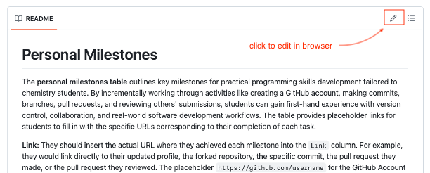
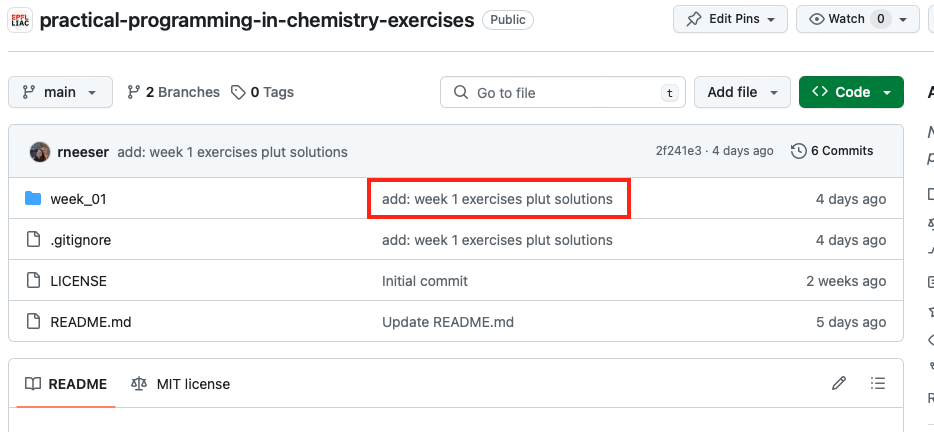
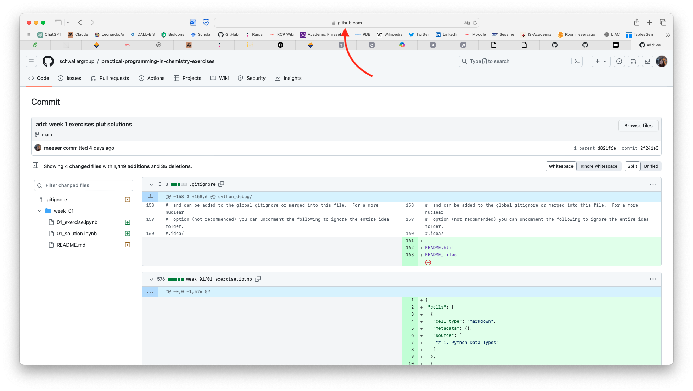

# Personal Milestones

The **personal milestones table** outlines key milestones for practical programming skills development tailored to chemistry students. By incrementally working through activities like creating a GitHub account, making commits, branches, pull requests, and reviewing others' submissions, students can gain first-hand experience with version control, collaboration, and real-world software development workflows. The table provides placeholder links for students to fill in with the specific URLs corresponding to their completion of each task.

**Link:** They should insert the actual URL where they achieved each milestone into the `Link` column. For example, they would link directly to their updated profile, the forked repository, the specific commit, the pull request they made, or the pull request they reviewed. :exclamation: Replace the placeholders (including `'`) with the actual URLs :exclamation: - only the marked sections will change.


| Week | Milestone                                   | Link                                                                        |      
|------|---------------------------------------------|-----------------------------------------------------------------------------|
| 1    | Github Account Created                      | https://github.com/MGalka66                                                 | 
| 1    | Github Profile Page                         | https://github.com/MGalka66/MGalka66                                        |
| 1    | Commit and Push Change from Command Line    | https://github.com/MGalka66/ppchem/commit/a29eb72d951c26de67b3454299d6ee6258dbb302               |
| 1    | Create a New Branch                         | https://github.com/MGalka66/ppchem/tree/test-branch          |
| 1    | Create a conda environment                  | https://github.com/MGalka66/ppchem/blob/main/env.yml      |
| 1    | Fork a Repo                                 | https://github.com/MGalka66/practical-programming-in-chemistry-milestones |
| 1    | (Optional) Make a Pull Request              |https://github.com/MGalka66/ppchem/pull/1|
| 2    | (Optional) Review a Pull Request            | https://github.com/MGalka66/practical-programming-in-chemistry-milestones/commit/085181b5fca3eb9dec82a5dcbc9de72d83cc360f |
| 4    | Update `env.yml` via a Pull Request         | https://github.com/MGalka66/practical-programming-in-chemistry-milestones/pull/1 |

**More milestones will be added throughout the course

## How to use this milestones table

### Step 1: Fork the Repository
Each student should start by forking this repository that contains the milestones list. This is done on GitHub by navigating to the repository's page and clicking the "Fork" button. This creates a copy of the repository in the student's own GitHub account.

### Step 2: Clone the Forked Repository
Next, the student clones their forked repository to their local machine, creating a local working copy. This is done using the Git command line interface (CLI) with the following command :

```bash
git clone https://github.com/MGalka66/practical-programming-in-chemistry-milestones.git
```

Replace `username` with your GitHub username.

### Step 3: Modify the milestones table
In order to show that you succesfully accomplished the milestones, please edit the table above by replacing the placeholder links with valid links. These should point us to the specific place on your GitHub. The easiest way to edit this `README` file by in-browser editing, like so:



<details>
<summary>How to find a commit link</summary>
  
  1. Go to your repository on GitHub.
  2. Navigate to the commit message that you used to push your image of the molecule. This is an example of a commit online:
  
  3. By clicking on this commit message you open a detailed view of this commit. Copy the link to that page.
  

</details>

## How to get updates on the milestones table

### Step 4: Set Up the Upstream Repository
After cloning the forked repository, the student should navigate into the repository's directory using the command line and set up the original repository as an upstream remote. This links the local copy to the original repository, allowing the student to pull updates.

```bash
cd practical-programming-in-chemistry-milestones
git remote add upstream https://github.com/schwallergroup/practical-programming-in-chemistry-milestones.git
```

### Step 5: Pull Updates from the Upstream Repository
Whenever the instructor updates the upstream repository (e.g., adding new milestones or resources), students can synchronize their local and forked copies with those updates. To do this, they first pull the changes from the upstream repository to their local repository:

```
git fetch upstream
git merge upstream/main main
```
Here, `main` is the branch name of your repo, `upstream` refers to the repo on the `schwallergroup`, and `upstream/main` to its main branch.

### Step 6: Push Updates to the Forked Repository
After merging the updates from the upstream repository into their local repository, students may need to push these updates to their forked repository on GitHub:

```bash
git push origin main
```

`origin` refers to your forked repository. So, you will push the changes to your own main branch.


